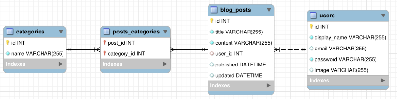

# BlogsAPI
> Esta aplicação consiste na construção de um CRUD de blogs. 

## 💻 Projeto

A aplicação possui a funcionalidade do usuário criar uma conta, fazer login pois em algumas rotas é necessário validar se o usuário está realmente logado para ter acesso, como criação, listagem, edição, exclusão. Para isso é gerado um token a cada vez que o usuário loga na aplicação. Este token é usado para ter acesso a outras rotas.

## 📈 Diagrama de entidade e relacionamento

## 🚀 Tecnologias
> Este projeto foi desenvolvido com as seguintes tecnologias:

- NodeJs
- ExpressJS
- MSC
- Mysql
- JWT
- Sequelize
- JOI
- ExpressAsyncErrors

## 📌 Habilidades

> Neste projeto, desenvolvi as seguintes habilidades:

- Manipulação de dados utilizando Sequelize;
- Relacionamentos entre tabelas;
- Rotas autenticadas;

## 💬 Contatos

   
  

